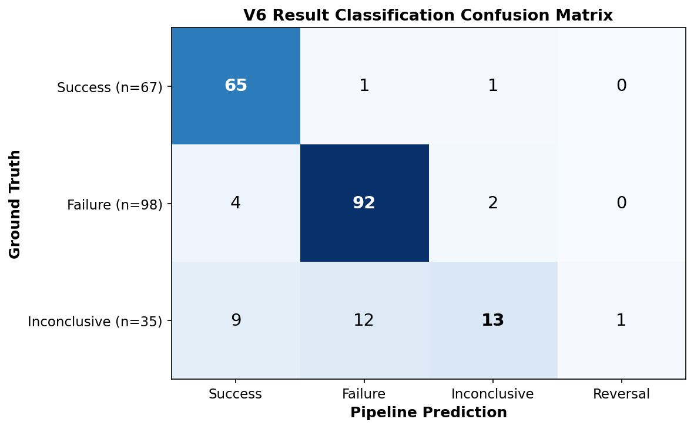

# V6 Extraction Pipeline: Performance Report

*February 2026*

The Metascience Observatory uses an automated extraction pipeline to identify and classify replication studies from the academic literature. This report summarizes the measured performance of the V6 pipeline, which uses Claude Sonnet 4.5 to extract structured replication data from academic papers.

## Evaluation methodology

We evaluated the pipeline against a hand-validated ground truth dataset of **226 replication entries** across **145 unique replication papers**, drawn primarily from psychology and related social sciences. Each ground truth entry was manually verified for correctness of the original study URL, result classification, and key statistical fields.

We also performed manual spot checks on new batches of papers not in the ground truth set, reading the full text of each paper (abstract, results, and discussion sections) to verify extraction accuracy.

## Entry-level matching

Of the 226 ground truth entries, the V6 pipeline successfully matched **200 (88.5%)**. The 26 unmatched entries were primarily due to papers missing from the extraction dataset or cases where the pipeline identified the replication target differently than the ground truth.

## Precision and false positives

The pipeline extracted 283 entries from 141 papers, compared to 226 ground truth entries across 145 papers. All 141 pipeline papers are genuine replication papers — **zero false positives at the paper level**. The pipeline never flagged a non-replication paper as containing replications.

Among unmatched pipeline entries, the main source of error is **wrong original study identification** (22 cases): the pipeline correctly detected that a replication occurred but attributed it to the wrong original study. The remaining unmatched entries appear to be additional legitimate replications that the ground truth did not include.

## Bibliographic metadata accuracy

For the 200 matched entries, accuracy on individual bibliographic fields was high:

| Field | Accuracy |
|-------|----------|
| Year | 97.0% |
| Journal | 96.0% |
| Title | 94.0% |
| Authors | 91.0% |
| **All four fields correct** | **79.5%** |

## Original study URL retrieval

The pipeline resolved original study DOIs through a combination of in-paper extraction and post-processing title-to-DOI resolution (via OpenAlex, Crossref, and EuropePMC APIs).

- **URL recall**: 70.8% (114/161 ground truth URLs recovered)
- **URL precision when present**: 93.0% match rate
- **No fabricated DOIs**: The pipeline does not hallucinate DOIs

The primary source of missed URLs is references that lack DOIs in the source paper's reference list, limiting downstream resolution.

## Result classification

Overall classification accuracy was **85.0%** (170/200), with strong performance on clear-cut cases and weaker performance on ambiguous ones:

| Classification | Accuracy | Notes |
|----------------|----------|-------|
| Success | 97.0% (65/67) | Rarely misclassified |
| Failure | 93.9% (92/98) | Rarely misclassified |
| Inconclusive | 37.1% (13/35) | Under-predicted; often classified as success or failure |

Confusion matrix (rows = ground truth, columns = pipeline prediction):

Most "inconclusive" errors are cases the pipeline classified as either "failure" (12 cases) or "success" (9 cases). This reflects both the inherent subjectivity of borderline classifications and a tendency for the pipeline to commit to binary outcomes where the ground truth annotators favored a more cautious label. Some of these disagreements may reflect genuine ambiguity rather than extraction errors.

## Statistical data extraction

The pipeline extracts sample sizes, effect sizes, and p-values for both original and replication studies when reported. Coverage measures how often the pipeline extracts a value when the ground truth has one. Exact match measures how often the extracted value is correct (within 0.1% relative error).

| Field | Ground truth has | Pipeline extracted | Coverage | Exact match |
|-------|-----------------|-------------------|----------|-------------|
| Replication N | 171 | 171 | 100.0% | 89.5% (153/171) |
| Replication p-value | 149 | 149 | 100.0% | 97.3% (145/149) |
| Original effect size | 132 | 129 | 97.7% | 95.3% (122/128) |
| Replication effect size | 146 | 139 | 95.2% | 96.4% (134/139) |
| Original p-value | 44 | 45 | 102.3% | 100.0% (43/43) |
| Original N | 137 | 128 | 93.4% | 89.8% (115/128) |

Coverage is consistently above 93% across all fields, with perfect coverage on replication sample sizes and p-values. When values are extracted, they are correct over 89% of the time. Sample size mismatches are typically due to different definitions of N (e.g., total participants vs. per-condition) rather than extraction errors. Effect size and p-value extraction is highly accurate.

## Manual spot checks

In addition to the formal benchmark, we conducted thorough manual spot checks on papers outside the ground truth set. In the most recent batch (February 2026, 6 papers checked in detail), **all 6 papers were extracted correctly** (100% accuracy), including:

- Complex multi-replication papers correctly split into separate entries
- Correct distinction between review articles citing replications and actual replication studies
- Accurate success/failure/inconclusive classifications verified against Discussion sections
- Precise statistical extraction matching values in the source text

## Known limitations

1. **Inconclusive under-prediction**: The pipeline classifies ambiguous cases as success or failure more often than human annotators would. We continue to refine the prompt to encourage more liberal use of the "inconclusive" category.

2. **DOI resolution ceiling**: When the original study's DOI is not present in the source paper's reference list, downstream resolution depends on title matching, which is imperfect.

3. **Ground truth subjectivity**: Some classification disagreements between the pipeline and ground truth may reflect legitimate differences in interpretation rather than errors. Result classification for borderline cases is inherently subjective.

## Cost and efficiency

Running on Claude Sonnet 4.5, the pipeline processes each paper in approximately 80 seconds at a cost of roughly $0.45 per paper ($0.35 per extracted replication entry). Compared to the previous V5 pipeline, V6 extracts 11% more replication entries at only 7% higher cost per entry, while adding explanation fields (present in 89% of extractions vs. 0% in V5).
